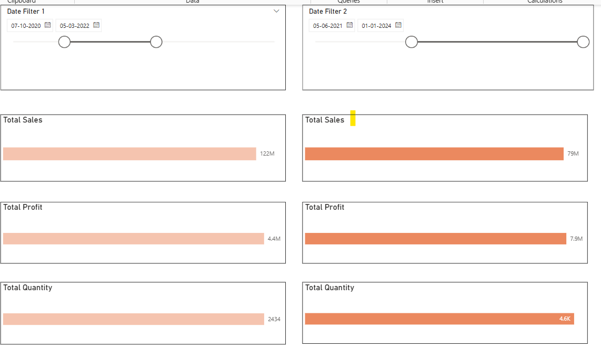
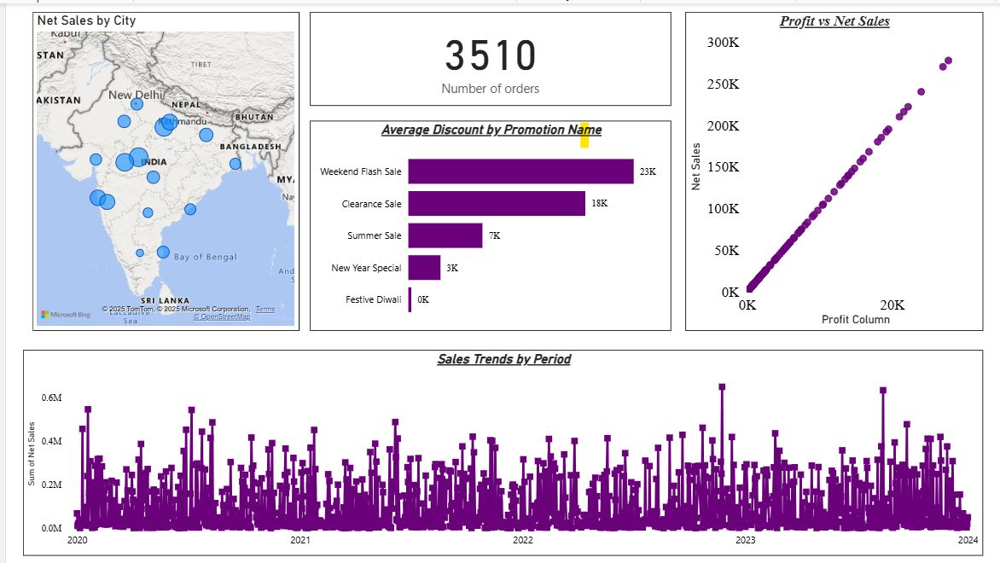
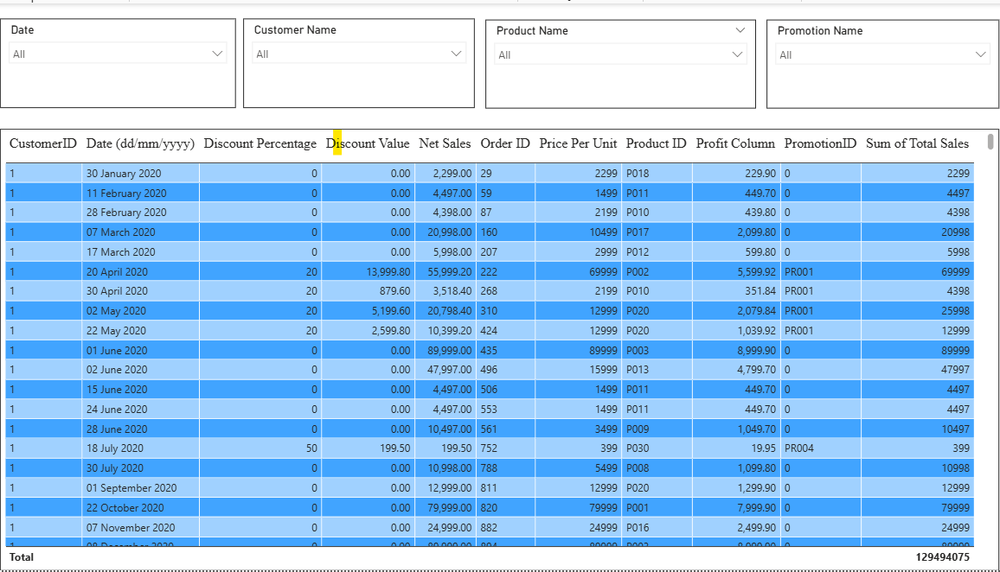
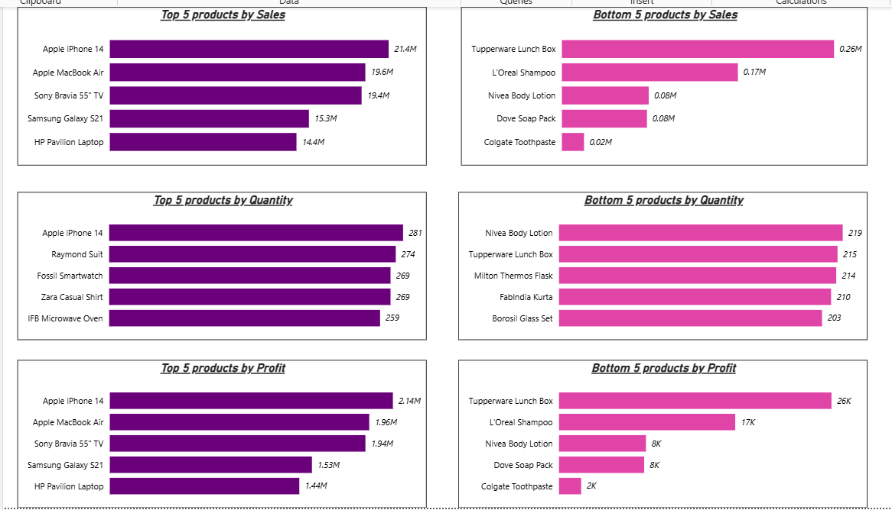
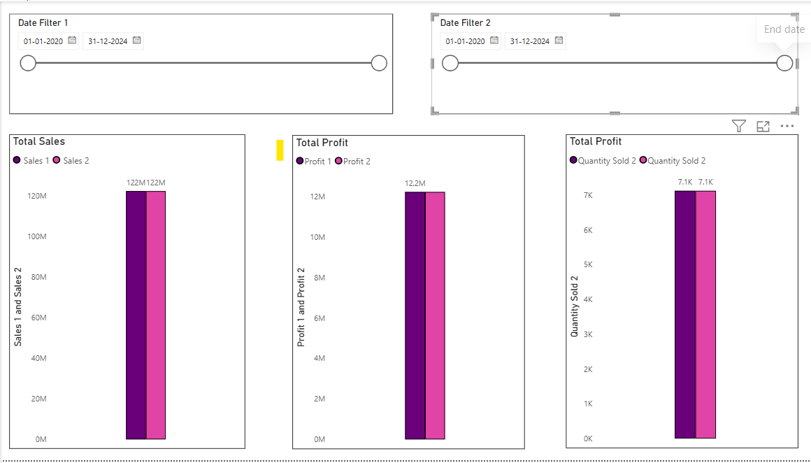

# 📊 Electrohub Sales Analysis (Power BI Project)

A detailed Sales Data Analysis project built in **Power BI**, focusing on an offline retail store named **Electrohub** that sells:

🛍️ Electronics, Footwear, Clothing, Home Appliances, Accessories, Kitchenware, Bags, Personal Care products.

---

## 📌 Business Requirements

1. 🔝 Top/Bottom 5 products by **Sales**, **Profit**, and **Quantity Sold**
2. 📅 Analyze **sales trends** across time: daily, monthly, quarterly, and yearly
3. 💹 Understand the **relationship between Sales and Profit**
4. 🆚 **Compare** sales/profit/quantity sold between **two custom periods**
5. 🧾 Analyze **average discounts** by discount category
6. 🔢 Display total number of **orders**
7. 🧮 View all relevant KPIs like **Sales**, **Profit**, **Discount**, **Net Sales** per order, filterable by:
   - Product
   - Date
   - Customer ID
   - Promotion Category
8. 🌍 Visualize **Sales by City**

---

## 📁 File Structure

| File | Description |
|------|-------------|
| `Project.pbix` | Power BI dashboard file |
| `Raw_Store_Data.xlsx` | Source dataset used in Power BI |
| `images/` | Dashboard preview screenshots |
| `README.md` | Project documentation |

---

## 🖼️ Dashboard Preview

### 🛠️ Edit Interaction  

### 📈 Sales Trend  

### 🧮 Table Visuals  

### 🏆 Top/Bottom 5 Products  

### 🆚 Comparison Between 2 Dates *(Optional)*  

---

## 📌 Tools Used

- Power BI (Desktop)
- Excel (Raw Data Cleanup)
- DAX for calculated measures
- GitHub for version control and hosting

---

## 🤝 Connect

>  star ⭐ the repo or drop your feedback!
